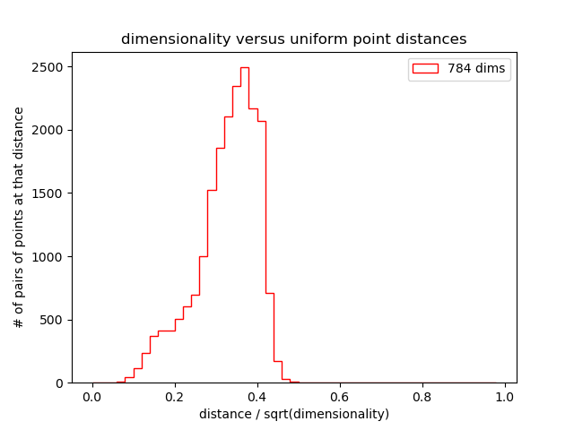

#CMSC422 Project1 WriteUp
### Siyuan Peng, Shi Jiunn Teo
#### WU1: why is this computation equivalent to computing classification accuracy?
Since ```datasets.TennisData.Y``` and ```h.predictAll(datasets.TennisData.X)``` return a numpy array. The result of comparing them with 0 returns
a binary array (true-false array) indicating which number is larger than 0. Then comparing the two binary array will produce another binary array, in which
True means the prediction is correct and False means the prediction is wrong. Also, when taking the mean of a binary numpy array, True is considered as 1 and
false is considered as 0. Therefore, ```np.mean(prediction == ground_truth)``` equals to (number of correct prediction)/(total number of prediction). Another 
#### WU2: We should see training accuracy (roughly) going down and test accuracy (roughly) going up. Why does training accuracy tend to go down? Why is test accuracy not monotonically increasing? You should also see jaggedness in the test curve toward the left. Why?
Training accuracy tends to go down because we are training the decision tree algorithm on data with labels (supervised learning). The goal of the decision tree
is to minimize the training error. However, the test accuracy is not monotonically increasing because there may be examples that the algorithm is not ready for.
In other words, the more the training accuracy increases on the training set the more the decision tree will overfit on that specific training set and thus not
generalize well on unseen test set. We will see jaggedness in the beginning of the test curve because our training set cannot fully represent the test set or 
even the entire distribution of the datasets. Therefore, the decision tree would overfit (graph will go up) and underfit (graph will go down), but eventually
we might focus on the right feature and produce a steady increasing test accuracy. 
#### WU3: You should see training accuracy monotonically increasing and test accuracy making something like a hill. Which of these is guaranteed to happen and which is just something we might expect to happen? Why?
We can guarantee that the training accuracy will monotonically increase. This is because the deeper we go, the better our tree will fit the training data. 
By construction, when the tree is complete and as long as the training set is consistent, we should get a 0 training error. We should expect the test curve
to shaped like a wavy hill because we can not guarantee that our training set could fully represent our test set or entire distribution datasets are taken from.
The test accuracy might vary, but we can hope that the decision tree would focus on the right feature and increase the test accuracy. But we can never guarantee
that the test accuracy will monotonically increase.
#### WU4: For the digits data, generate train/test curves for varying values of K and epsilon (you figure out what are good ranges, this time). Include those curves: do you see evidence of overfitting and underfitting? Next, using K=5, generate learning curves for this data.
For Epsilon NN, we have the following graph: these three graphs have radius of 6, 8, 10 separately.


It's heavily overfitting when the radius is 6, but it gets better when we set the radius to 10

For KNN, the following graphs have K = 1, 3, 5:


Knn exbits similiar patter as Epsilon NN: when K = 6, the model heavily overfitting. As K increase, it's getting better.

**Learning Curve for K = 5**:

#### WU5: 
- ##### A. First, get a histogram of the raw digits data in 784 dimensions. You'll probably want to use the computeDistances function together with the plotting in HighD. 
  
- ##### B. Rewrite computeDistances so that it can subsample features down to some fixed dimensionality. For example, you might write computeDistancesSubdims(data, d), where d is the target dimensionality. In this function, you should pick d dimensions at random (I would suggest generating a permutation of the number [1..784] and then taking the first d of them), and then compute the distance but only looking at those dimensions. 
  
- ##### C. Generate an equivalent plot to HighD with d in [2, 8, 32, 128, 512] but for the digits data rather than the random data. Include a copy of both plots and describe the differences.
  
#### WU6: 
- ##### Using the tools provided, generate (a) a learning curve (x-axis=number of training examples) for the perceptron (5 epochs) on the sentiment data and 


- ##### (b) a plot of number of epochs versus train/test accuracy on the entire dataset.
